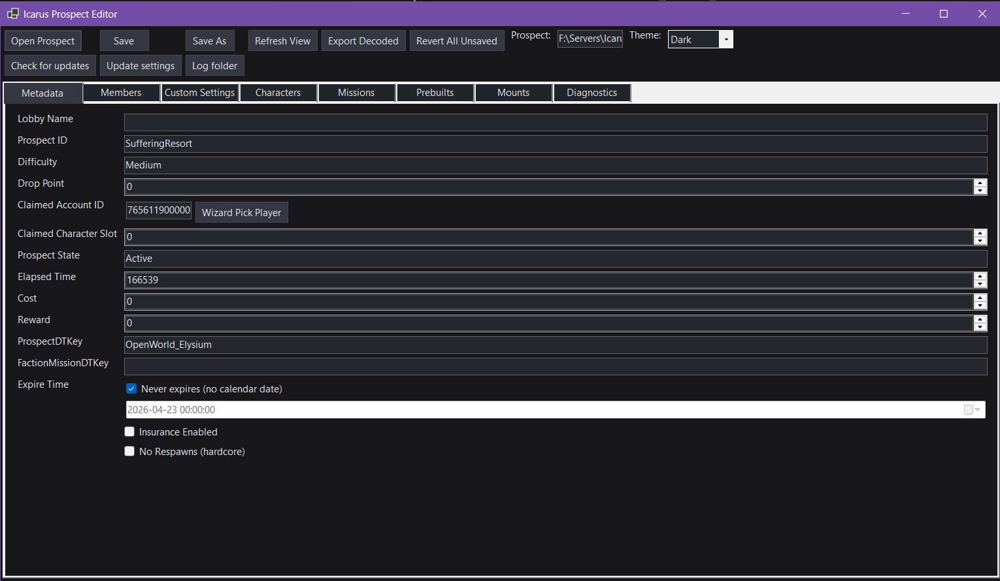
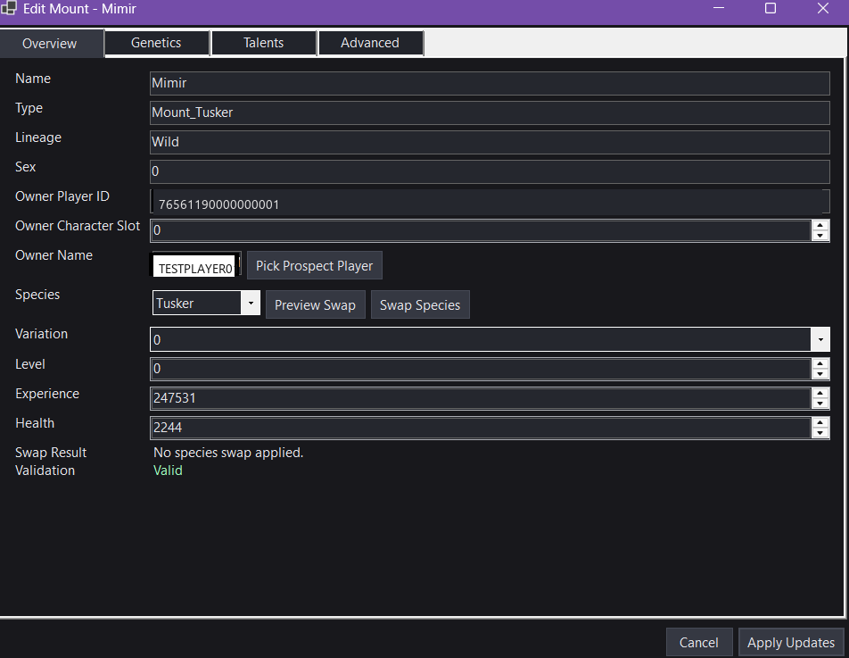
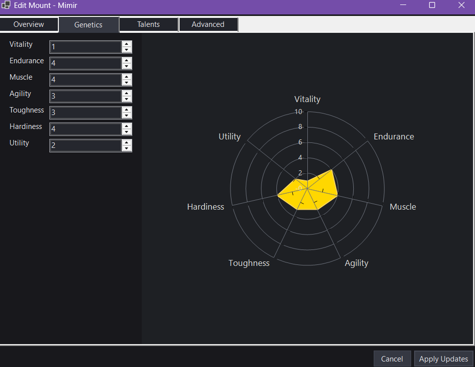

# Icarus Server Manager + Prospect Editor

[](https://github.com/DukeVenator/Icarus-Server-Manager-Tool/actions/workflows/dotnet-ci.yml)
[](https://codecov.io/gh/DukeVenator/Icarus-Server-Manager-Tool)
[](https://github.com/DukeVenator/Icarus-Server-Manager-Tool/releases)
[](https://github.com/DukeVenator/Icarus-Server-Manager-Tool/releases)
[](LICENSE.md)
[](https://dotnet.microsoft.com/download/dotnet/8.0)

This repo has two Windows tools that make Icarus hosting and prospect editing easier:

- **Icarus Server Manager**: install, configure, run, monitor, and maintain a dedicated server without hand-editing everything.
- **Icarus Prospect Editor**: edit decoded prospect JSON safely with validation, backups, and advanced mount tooling.

<!-- MANAGER_RELEASE_BLOCK -->
**Latest Server Manager release:** [manager-v2.0.0](https://github.com/DukeVenator/Icarus-Server-Manager-Tool/releases/tag/manager-v2.0.0) — on that page, download **IcarusServerManager-manager-v2.0.0-win-x64.zip** from **Assets** (Windows; requires [.NET 8 Desktop Runtime](https://dotnet.microsoft.com/download/dotnet/8.0)).
<!-- /MANAGER_RELEASE_BLOCK -->

<!-- EDITOR_RELEASE_BLOCK -->
**Latest Prospect Editor release:** [editor-v1.0.0](https://github.com/DukeVenator/Icarus-Server-Manager-Tool/releases/tag/editor-v1.0.0) — on that page, download **IcarusProspectEditor-editor-v1.0.0-win-x64.zip** from **Assets** (Windows; requires [.NET 8 Desktop Runtime](https://dotnet.microsoft.com/download/dotnet/8.0)).
<!-- /EDITOR_RELEASE_BLOCK -->

**Last tested with Icarus Dedicated Server build:** 227

---

## Pick Your Tool

### Use Server Manager if you want to
- Install/update Icarus dedicated server with SteamCMD.
- Start/stop the server from a UI with safer shutdown handling.
- Configure INI settings, restart policies, Discord notifications, and console filters.
- Watch live stats (CPU, memory, uptime, restart history, player hints).

### Use Prospect Editor if you want to
- Open and edit decoded prospect JSON.
- Update metadata, members, custom settings, and mount details.
- Use mount species swap/remap tools with validation and range clamping.
- Export decoded data and inspect low-level recorder fields when needed.

---

## Quick Start: Server Manager

1. Download the manager zip from the **Latest Server Manager release** block above.
2. Extract and run `IcarusServerManager.exe`.
3. In **Manager Settings**, set **Server install folder** (or run **Setup wizard**).
4. Click **Install/Update Server**.
5. In **Server Settings**, set name/ports/options.
6. Click **Save to INI**, then **Save Manager Options**.
7. Click **Start Server** and watch the **Console** tab.
8. Optional: enable restart policies and Discord notifications after first stable run.

---

## Quick Start: Prospect Editor

1. Download `IcarusProspectEditor-<tag>-win-x64.zip` from the latest editor release.
2. Extract and run `IcarusProspectEditor.exe`.
3. Click **Open Prospect** and select a decoded prospect JSON file.
4. Edit values in tabs (Metadata, Members, Custom Settings, Mounts).
5. Click **Save**.



### Important Safety Warning

- Always keep separate backups of your save/prospect files before editing.
- The editor includes backup-on-save and validation, but advanced edits can still create bad or game-incompatible data.
- You accept all risk for edits. The project maintainers are not liable for data loss, corruption, or broken saves.

---

## Server Manager Features

- Install or update the game server with one click.
- Start and stop the server from the app.
- Force stop if the server gets stuck.
- Setup wizard to help first-time users.
- Auto-restart after crashes.
- Auto-restart on a schedule (for example every X hours).
- Auto-restart if memory gets too high.
- Auto-restart when the server is empty.
- Daily maintenance window for planned restarts.
- Safer shutdown that gives the server time to save.
- Console with filters so it is easy to read.
- Preset log views (Minimal, Balanced, Verbose, QuietGame, Custom).
- Stats view with CPU, memory, and uptime.
- Chart history to spot issues over time.
- Export stats to CSV for troubleshooting.
- Last World view to check active prospect info.
- Prospect picker to swap the active world easily.
- Save and load server presets.
- Export and import full config bundles.
- One-click INI backup.
- World backup to zip or folder.
- Discord notifications with on/off toggles per event.
- Spam control for busy Discord channels.
- Light and dark theme.
- Built-in update checker for the app itself.

---

## Prospect Editor Features

- Open and edit decoded prospect files.
- Edit prospect info like name and difficulty.
- Edit member info.
- Edit custom settings.
- Edit mounts in a dedicated mount editor.
- Change a mount to a different species.
- Preview a species swap before applying it.
- Simple views for genetics and talents.
- Safer number ranges so you cannot enter extreme values.
- Highlights for unsaved changes.
- Revert all unsaved changes in one click.
- Revert single rows in some tabs.
- Automatic backup copy when saving over an existing file.
- Warnings before risky actions.
- Export decoded data for diagnostics.
- Fast export or detailed export options.
- Inspect raw fields (advanced only).
- Light and dark theme.
- Built-in update checker for the editor itself.

### Dedicated Mount Editor

Mounts have a dedicated editor with an **Overview** tab for species swaps with preview/validation, a **Genetics** tab with a radar visualization and clamped sliders, a **Talents** tab for reviewing talent ranks, and an **Advanced** tab for raw recorder fields (power-user only).





More editor views (Members, Characters / Recorder Inspector, Diagnostics, Talents, Raw recorder fields) are documented in the [Prospect Editor wiki pages](https://github.com/DukeVenator/Icarus-Server-Manager-Tool/wiki).

---

## Common Tasks

### Change server name or ports
1. Open **Server Settings**.
2. Edit values.
3. Click **Save to INI**.
4. Restart from the app.

### Move server config to another machine
1. Export a config bundle.
2. Copy it to the new machine.
3. Import bundle and validate paths.

### Back up world/prospect data
- Use backup actions in **Server Settings** (zip or folder copy).

### Keep Prospect Editor safe
- Use **Save As** before major edits.
- Keep external backups, not just `.bak` files.
- Treat recorder-level edits as advanced/high-risk changes.

---

## Release Tagging and CI (Maintainers)

### Tag strategy
- Server Manager releases: `manager-v*` (preferred), legacy `v*` still supported.
- Prospect Editor releases: `editor-v*`.

### What each workflow does
- `dotnet-ci.yml`: build + test for branches and PRs.
- `release-manager.yml`: packages manager zip, creates release, updates `MANAGER_RELEASE_BLOCK`.
- `release-editor.yml`: packages editor zip, creates release, updates `EDITOR_RELEASE_BLOCK`.

### Example commands

```bash
# Server Manager (preferred)
git tag manager-v1.0.9
git push origin manager-v1.0.9

# Server Manager (legacy track)
git tag v1.0.8
git push origin v1.0.8

# Prospect Editor
git tag editor-v1.0.1
git push origin editor-v1.0.1
```

---

## Requirements

- Windows
- .NET 8 Desktop Runtime for published builds
- .NET 8 SDK if building from source

---

## Where Files Are Stored

- Manager options: `%LocalAppData%\IcarusServerManager\manager-options.json`
- Manager logs: `logs\manager-YYYYMMDD.log` (next to executable)
- Prospect Editor logs: `%LocalAppData%\IcarusProspectEditor\logs\`
- Prospect Editor update settings: `%LocalAppData%\IcarusProspectEditor\prospect-editor-update.json`
- Server INI default: `Icarus\Saved\Config\WindowsServer\ServerSettings.ini`

---

## Build From Source

```bash
dotnet restore IcarusServerManager.sln
dotnet build IcarusServerManager.sln -c Release
dotnet test IcarusServerManager.sln -c Release
```

```bash
dotnet publish IcarusServerManager/IcarusServerManager.csproj -c Release -r win-x64 --self-contained false -o ./publish
dotnet publish IcarusProspectEditor/IcarusProspectEditor.csproj -c Release -r win-x64 --self-contained false -o ./publish-editor
```

---

## Wiki and References

- Project wiki: [Icarus Server Manager Tool Wiki](https://github.com/DukeVenator/Icarus-Server-Manager-Tool/wiki)
- Icarus launch/server parameters: [RocketWerkz Icarus Dedicated Server Wiki](https://github.com/RocketWerkz/IcarusDedicatedServer/wiki/Server-Config-&-Launch-Parameters)

---

## License

See [LICENSE.md](LICENSE.md).
